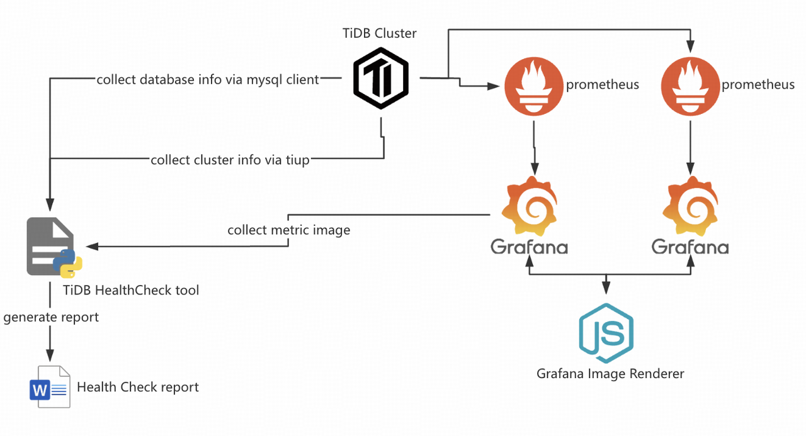

# tidb_healthcheck
This tool is using for collect TiDB cluster metrics and configuration data and generate HealthCheck report automatically.

## Requirements
- Grafana Image Render plugin or standalone Node.js application is required using for generate snapshot from Grafana;

- Mysql client should be installed to collect information from databases;

- TiUP command is required for the cluster information collection

### Supported operating systems
- Linux (x64)
- Windows (x64)
- Mac OS X (x64)

### Dependencies
python 3.7.9 is required if you need recompile the program

### Run as binary in Linux
Edit tidb_healthcheck.cfg to set connection and configuration parameters
$ ./tidb_healthcheck -c tidb_healthcheck.cfg

